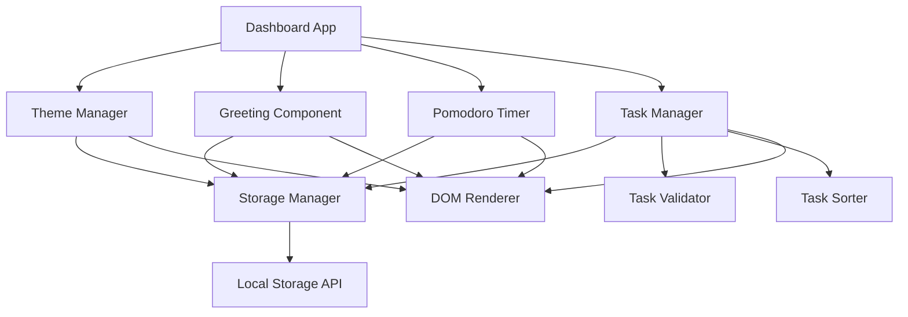

# Design Document: Dashboard Interactive Enhancements

## Overview

This design specifies the implementation of five interactive enhancements to an existing productivity dashboard web application. The dashboard is built with vanilla HTML, CSS, and JavaScript, using browser Local Storage for persistence. The enhancements add: light/dark mode toggle, custom name in greeting, customizable Pomodoro timer duration, duplicate task prevention, and task sorting capabilities.

### Design Goals

1. **Simplicity**: Maintain the clean, minimal interface of the existing dashboard
2. **Performance**: Ensure all interactions respond within specified time constraints
3. **Persistence**: Store all user preferences and data in Local Storage
4. **Maintainability**: Use clear, modular code structure with vanilla JavaScript
5. **Security**: Sanitize all user inputs to prevent XSS attacks
6. **Compatibility**: Support modern browsers (Chrome 90+, Firefox 88+, Edge 90+, Safari 14+)

### Technology Stack

- **Frontend**: Vanilla HTML5, CSS3, JavaScript (ES6+)
- **Storage**: Browser Local Storage API
- **No external dependencies**: Pure vanilla implementation

## Architecture

### High-Level Architecture

The application follows a component-based architecture where each feature is encapsulated in its own module with clear responsibilities. All components interact with a central Storage Manager for persistence.



### Component Responsibilities

1. **Dashboard App (Main Controller)**
   - Initializes all components on page load
   - Coordinates component interactions
   - Handles global error handling

2. **Theme Manager**
   - Manages light/dark mode state
   - Applies theme CSS classes to DOM
   - Persists theme preference

3. **Greeting Component**
   - Displays personalized greeting with time/date
   - Manages custom name input
   - Sanitizes user input
   - Persists custom name

4. **Pomodoro Timer**
   - Manages timer state (running, paused, stopped)
   - Handles custom duration settings
   - Validates duration input (1-120 minutes)
   - Persists timer duration

5. **Task Manager**
   - Manages task list state
   - Coordinates Task Validator and Task Sorter
   - Handles task CRUD operations
   - Persists task list

6. **Task Validator**
   - Validates task input before adding
   - Checks for duplicate tasks (case-insensitive, trimmed)
   - Provides error feedback

7. **Task Sorter**
   - Sorts tasks by multiple criteria
   - Maintains sort preference
   - Persists sort preference

8. **Storage Manager**
   - Abstracts Local Storage operations
   - Handles storage errors gracefully
   - Provides get/set/remove operations
   - Handles quota exceeded errors

### Data Flow

1. **User Interaction** → Component Event Handler
2. **Component** → Validates Input (if applicable)
3. **Component** → Updates Internal State
4. **Component** → Persists to Storage Manager
5. **Storage Manager** → Writes to Local Storage
6. **Component** → Updates DOM

### Error Handling Strategy

- **Storage Unavailable**: Display warning, continue with in-memory state
- **Quota Exceeded**: Display error message, prevent further writes
- **Invalid Input**: Display inline error message, prevent action
- **Unexpected Errors**: Log to console, display generic error message

## Components and Interfaces

### 1. Storage Manager

**Purpose**: Centralized interface for Local Storage operations with error handling.

**Interface**:
```javascript
class StorageManager {
  /**
   * Check if Local Storage is available
   * @returns {boolean}
   */
  isAvailable()
  
  /**
   * Get item from storage
   * @param {string} key
   * @returns {any|null}
   */
  get(key)
  
  /**
   * Set item in storage
   * @param {string} key
   * @param {any} value
   * @returns {boolean} Success status
   */
  set(key, value)
  
  /**
   * Remove item from storage
   * @param {string} key
   */
  remove(key)
  
  /**
   * Handle storage errors
   * @param {Error} error
   */
  handleError(error)
}
```

**Storage Keys**:
- `theme`: "light" | "dark"
- `customName`: string
- `pomodoroMinutes`: number (1-120)
- `tasks`: Task[]
- `sortPreference`: SortOption

### 2. Theme Manager

**Purpose**: Manage theme switching and persistence.

**Interface**:
```javascript
class ThemeManager {
  constructor(storageManager)
  
  /**
   * Initialize theme from storage or default
   */
  init()
  
  /**
   * Toggle between light and dark theme
   */
  toggle()
  
  /**
   * Apply theme to DOM
   * @param {string} theme - "light" | "dark"
   */
  applyTheme(theme)
  
  /**
   * Get current theme
   * @returns {string}
   */
  getCurrentTheme()
}
```

**DOM Structure**:
```html
<button id="theme-toggle" class="theme-toggle" aria-label="Toggle theme">
  <span class="theme-icon"></span>
</button>
```

**CSS Classes**:
- `.theme-light`: Applied to `<body>` for light mode
- `.theme-dark`: Applied to `<body>` for dark mode

### 3. Greeting Component

**Purpose**: Display personalized greeting with custom name.

**Interface**:
```javascript
class GreetingComponent {
  constructor(storageManager)
  
  /**
   * Initialize greeting with saved name
   */
  init()
  
  /**
   * Update greeting display
   */
  updateGreeting()
  
  /**
   * Handle name input change
   * @param {string} name
   */
  setCustomName(name)
  
  /**
   * Sanitize name input to prevent XSS
   * @param {string} name
   * @returns {string}
   */
  sanitizeName(name)
  
  /**
   * Get time-based greeting (Good morning/afternoon/evening)
   * @returns {string}
   */
  getTimeBasedGreeting()
}
```

**DOM Structure**:
```html
<div class="greeting-section">
  <h1 id="greeting-text" class="greeting"></h1>
  <input 
    type="text" 
    id="name-input" 
    class="name-input" 
    placeholder="Enter your name"
    maxlength="50"
  />
</div>
```

### 4. Pomodoro Timer

**Purpose**: Manage focus timer with customizable duration.

**Interface**:
```javascript
class PomodoroTimer {
  constructor(storageManager)
  
  /**
   * Initialize timer with saved duration
   */
  init()
  
  /**
   * Start timer
   */
  start()
  
  /**
   * Pause timer
   */
  pause()
  
  /**
   * Reset timer
   */
  reset()
  
  /**
   * Set custom duration
   * @param {number} minutes
   * @returns {boolean} Success status
   */
  setDuration(minutes)
  
  /**
   * Validate duration input
   * @param {number} minutes
   * @returns {boolean}
   */
  validateDuration(minutes)
  
  /**
   * Update timer display
   */
  updateDisplay()
  
  /**
   * Check if timer is running
   * @returns {boolean}
   */
  isRunning()
}
```

**DOM Structure**:
```html
<div class="timer-section">
  <div id="timer-display" class="timer-display">25:00</div>
  <div class="timer-controls">
    <button id="timer-start" class="btn-timer">Start</button>
    <button id="timer-pause" class="btn-timer">Pause</button>
    <button id="timer-reset" class="btn-timer">Reset</button>
  </div>
  <div class="timer-settings">
    <label for="timer-duration">Duration (minutes):</label>
    <input 
      type="number" 
      id="timer-duration" 
      min="1" 
      max="120" 
      value="25"
    />
    <span id="timer-error" class="error-message"></span>
  </div>
</div>
```

### 5. Task Manager

**Purpose**: Coordinate task operations, validation, and sorting.

**Interface**:
```javascript
class TaskManager {
  constructor(storageManager, validator, sorter)
  
  /**
   * Initialize task list from storage
   */
  init()
  
  /**
   * Add new task
   * @param {string} text
   * @returns {boolean} Success status
   */
  addTask(text)
  
  /**
   * Toggle task completion
   * @param {string} taskId
   */
  toggleTask(taskId)
  
  /**
   * Delete task
   * @param {string} taskId
   */
  deleteTask(taskId)
  
  /**
   * Get all tasks
   * @returns {Task[]}
   */
  getTasks()
  
  /**
   * Apply current sort preference
   */
  applySorting()
  
  /**
   * Render task list to DOM
   */
  render()
}
```

### 6. Task Validator

**Purpose**: Validate task input and check for duplicates.

**Interface**:
```javascript
class TaskValidator {
  /**
   * Validate task before adding
   * @param {string} text - Raw task text
   * @param {Task[]} existingTasks - Current task list
   * @returns {{valid: boolean, error: string|null}}
   */
  validate(text, existingTasks)
  
  /**
   * Check if task is duplicate
   * @param {string} text - Normalized task text
   * @param {Task[]} existingTasks
   * @returns {boolean}
   */
  isDuplicate(text, existingTasks)
  
  /**
   * Normalize task text for comparison
   * @param {string} text
   * @returns {string}
   */
  normalizeText(text)
}
```

### 7. Task Sorter

**Purpose**: Sort tasks by various criteria.

**Interface**:
```javascript
class TaskSorter {
  constructor(storageManager)
  
  /**
   * Sort tasks by selected criteria
   * @param {Task[]} tasks
   * @param {SortOption} option
   * @returns {Task[]}
   */
  sort(tasks, option)
  
  /**
   * Set sort preference
   * @param {SortOption} option
   */
  setSortPreference(option)
  
  /**
   * Get current sort preference
   * @returns {SortOption}
   */
  getSortPreference()
}
```

**Sort Options**:
```javascript
const SortOption = {
  DATE_NEWEST: 'date-newest',
  DATE_OLDEST: 'date-oldest',
  ALPHA_AZ: 'alpha-az',
  ALPHA_ZA: 'alpha-za',
  STATUS_INCOMPLETE_FIRST: 'status-incomplete',
  STATUS_COMPLETE_FIRST: 'status-complete'
}
```

**DOM Structure**:
```html
<div class="task-section">
  <div class="task-controls">
    <input 
      type="text" 
      id="task-input" 
      class="task-input" 
      placeholder="Add a new task"
    />
    <button id="task-add" class="btn-add">Add</button>
    <span id="task-error" class="error-message"></span>
  </div>
  
  <div class="sort-controls">
    <label for="sort-select">Sort by:</label>
    <select id="sort-select" class="sort-select">
      <option value="date-newest">Newest First</option>
      <option value="date-oldest">Oldest First</option>
      <option value="alpha-az">A to Z</option>
      <option value="alpha-za">Z to A</option>
      <option value="status-incomplete">Incomplete First</option>
      <option value="status-complete">Complete First</option>
    </select>
  </div>
  
  <ul id="task-list" class="task-list"></ul>
</div>
```

## Data Models

### Task

```javascript
/**
 * @typedef {Object} Task
 * @property {string} id - Unique identifier (timestamp-based)
 * @property {string} text - Task description
 * @property {boolean} completed - Completion status
 * @property {number} createdAt - Unix timestamp
 */
```

**Example**:
```javascript
{
  id: "1234567890123",
  text: "Complete project documentation",
  completed: false,
  createdAt: 1234567890123
}
```

### Storage Schema

**Local Storage Structure**:
```javascript
{
  "theme": "dark",
  "customName": "Alex",
  "pomodoroMinutes": 30,
  "tasks": [
    {
      "id": "1234567890123",
      "text": "Complete project documentation",
      "completed": false,
      "createdAt": 1234567890123
    }
  ],
  "sortPreference": "date-newest"
}
```

## Correctness Properties

*A property is a characteristic or behavior that should hold true across all valid executions of a system—essentially, a formal statement about what the system should do. Properties serve as the bridge between human-readable specifications and machine-verifiable correctness guarantees.*

### Assessment of Property-Based Testing Applicability

This feature involves significant UI rendering, DOM manipulation, and browser API interactions. However, several core logic functions are pure and suitable for property-based testing:

1. **Task duplicate detection** - Pure comparison logic
2. **Task sorting algorithms** - Pure transformation logic
3. **Input validation** - Pure validation logic
4. **Text normalization** - Pure string transformation
5. **Name sanitization** - Pure string transformation

Property-based testing IS appropriate for these pure logic components. The UI interaction and rendering aspects will be covered by unit tests and integration tests.


### Property 1: Duplicate Detection with Normalization

*For any* task text and any existing task list, when checking for duplicates, the validator SHALL detect a duplicate if and only if the normalized (trimmed, lowercase) task text matches any existing task's normalized text, regardless of the existing task's completion status.

**Validates: Requirements 4.1, 4.2, 4.3, 4.6**

### Property 2: Task List Invariant on Duplicate Rejection

*For any* task list and any duplicate task text, when attempting to add the duplicate task, the task list SHALL remain completely unchanged (same tasks, same order, same properties).

**Validates: Requirements 4.5**

### Property 3: Duration Validation Range

*For any* integer value, the timer duration validator SHALL accept the value if and only if it is between 1 and 120 inclusive, rejecting all values outside this range.

**Validates: Requirements 3.2**

### Property 4: Name Sanitization Prevents HTML Injection

*For any* string input containing HTML tags or script elements, the name sanitization function SHALL produce output that, when rendered in the DOM, does not execute scripts or render as HTML elements.

**Validates: Requirements 2.7**

### Property 5: Sort by Date Oldest Produces Ascending Order

*For any* task list, when sorted by date oldest first, the resulting list SHALL be ordered such that for all adjacent tasks, the earlier task's createdAt timestamp is less than or equal to the later task's createdAt timestamp.

**Validates: Requirements 5.2**

### Property 6: Sort by Date Newest Produces Descending Order

*For any* task list, when sorted by date newest first, the resulting list SHALL be ordered such that for all adjacent tasks, the earlier task's createdAt timestamp is greater than or equal to the later task's createdAt timestamp.

**Validates: Requirements 5.3**

### Property 7: Sort Alphabetically A-Z Produces Ascending Order

*For any* task list, when sorted alphabetically A to Z, the resulting list SHALL be ordered such that for all adjacent tasks, the earlier task's text is lexicographically less than or equal to the later task's text (case-insensitive comparison).

**Validates: Requirements 5.4**

### Property 8: Sort Alphabetically Z-A Produces Descending Order

*For any* task list, when sorted alphabetically Z to A, the resulting list SHALL be ordered such that for all adjacent tasks, the earlier task's text is lexicographically greater than or equal to the later task's text (case-insensitive comparison).

**Validates: Requirements 5.5**

### Property 9: Sort by Status Incomplete First Groups Correctly

*For any* task list, when sorted by status with incomplete first, the resulting list SHALL have all incomplete tasks appearing before all completed tasks.

**Validates: Requirements 5.6**

### Property 10: Sort by Status Complete First Groups Correctly

*For any* task list, when sorted by status with complete first, the resulting list SHALL have all completed tasks appearing before all incomplete tasks.

**Validates: Requirements 5.7**

### Property 11: Stable Sort Maintains Relative Order

*For any* task list sorted by completion status, when multiple tasks share the same completion status, those tasks SHALL maintain their relative order by creation date (newest first) from before the sort operation.

**Validates: Requirements 5.12**

### Property 12: Text Normalization is Idempotent

*For any* task text, applying the normalization function (trim and lowercase) multiple times SHALL produce the same result as applying it once.

**Validates: Requirements 4.2, 4.3**

## Error Handling

### Input Validation Errors

**Invalid Timer Duration**:
- **Trigger**: User enters duration < 1 or > 120
- **Response**: Display inline error message "Duration must be between 1 and 120 minutes"
- **State**: Reject input, maintain current duration, keep settings enabled

**Empty Task Input**:
- **Trigger**: User attempts to add task with empty or whitespace-only text
- **Response**: Display inline error message "Task cannot be empty"
- **State**: Reject input, clear input field, maintain current task list

**Duplicate Task**:
- **Trigger**: User attempts to add task that matches existing task (after normalization)
- **Response**: Display inline error message "This task already exists"
- **State**: Reject input, maintain input field value, maintain current task list

### Storage Errors

**Local Storage Unavailable**:
- **Trigger**: Local Storage API not available (private browsing, disabled)
- **Response**: Display persistent warning banner "Storage unavailable. Your data will not be saved."
- **State**: Continue with in-memory state, all features functional

**Quota Exceeded**:
- **Trigger**: Local Storage quota exceeded when attempting to save
- **Response**: Display error message "Storage limit reached. Unable to save changes."
- **State**: Maintain current in-memory state, prevent further writes

### Runtime Errors

**Unexpected Errors**:
- **Trigger**: Any uncaught exception
- **Response**: Log error to console, display generic message "An error occurred. Please refresh the page."
- **State**: Attempt to maintain current state, may require page refresh

## Testing Strategy

### Unit Testing

**Purpose**: Verify specific examples, edge cases, and component behavior.

**Framework**: Use a lightweight testing framework like Jest or Vitest (or vanilla JavaScript test runner).

**Test Coverage**:

1. **Storage Manager**
   - Test get/set/remove operations
   - Test error handling for unavailable storage
   - Test quota exceeded handling
   - Test JSON serialization/deserialization

2. **Theme Manager**
   - Test toggle switches between light and dark
   - Test default theme is light
   - Test theme persistence
   - Test theme loading from storage

3. **Greeting Component**
   - Test generic greeting when no name
   - Test custom name appears in greeting
   - Test whitespace-only names show generic greeting
   - Test name persistence
   - Test time-based greeting (morning/afternoon/evening)

4. **Pomodoro Timer**
   - Test default duration is 25 minutes
   - Test timer start/pause/reset
   - Test settings disabled when running
   - Test duration persistence
   - Test display formatting (MM:SS)

5. **Task Manager**
   - Test add/toggle/delete operations
   - Test task persistence
   - Test rendering updates DOM

6. **Task Validator**
   - Test empty input rejection
   - Test duplicate detection examples
   - Test deleted tasks can be re-added

7. **Task Sorter**
   - Test each sort option with example task lists
   - Test sort preference persistence
   - Test default sort order

### Property-Based Testing

**Purpose**: Verify universal properties across all inputs using randomized testing.

**Framework**: Use fast-check (JavaScript property-based testing library).

**Configuration**: Minimum 100 iterations per property test.

**Test Coverage**:

1. **Property 1: Duplicate Detection with Normalization**
   - **Generator**: Random task lists and task text with varied casing and whitespace
   - **Test**: Verify duplicate detection works correctly with normalization
   - **Tag**: `Feature: dashboard-interactive-enhancements, Property 1: Duplicate detection with normalization`

2. **Property 2: Task List Invariant on Duplicate Rejection**
   - **Generator**: Random task lists and duplicate task text
   - **Test**: Verify task list unchanged when duplicate rejected
   - **Tag**: `Feature: dashboard-interactive-enhancements, Property 2: Task list invariant on duplicate rejection`

3. **Property 3: Duration Validation Range**
   - **Generator**: Random integers (including negative, zero, and large values)
   - **Test**: Verify validation accepts 1-120, rejects all others
   - **Tag**: `Feature: dashboard-interactive-enhancements, Property 3: Duration validation range`

4. **Property 4: Name Sanitization Prevents HTML Injection**
   - **Generator**: Random strings including HTML tags, script tags, special characters
   - **Test**: Verify sanitized output doesn't execute scripts or render HTML
   - **Tag**: `Feature: dashboard-interactive-enhancements, Property 4: Name sanitization prevents HTML injection`

5. **Property 5: Sort by Date Oldest Produces Ascending Order**
   - **Generator**: Random task lists with varied timestamps
   - **Test**: Verify sorted list is in ascending timestamp order
   - **Tag**: `Feature: dashboard-interactive-enhancements, Property 5: Sort by date oldest produces ascending order`

6. **Property 6: Sort by Date Newest Produces Descending Order**
   - **Generator**: Random task lists with varied timestamps
   - **Test**: Verify sorted list is in descending timestamp order
   - **Tag**: `Feature: dashboard-interactive-enhancements, Property 6: Sort by date newest produces descending order`

7. **Property 7: Sort Alphabetically A-Z Produces Ascending Order**
   - **Generator**: Random task lists with varied text
   - **Test**: Verify sorted list is in ascending lexicographic order
   - **Tag**: `Feature: dashboard-interactive-enhancements, Property 7: Sort alphabetically A-Z produces ascending order`

8. **Property 8: Sort Alphabetically Z-A Produces Descending Order**
   - **Generator**: Random task lists with varied text
   - **Test**: Verify sorted list is in descending lexicographic order
   - **Tag**: `Feature: dashboard-interactive-enhancements, Property 8: Sort alphabetically Z-A produces descending order`

9. **Property 9: Sort by Status Incomplete First Groups Correctly**
   - **Generator**: Random task lists with mixed completion status
   - **Test**: Verify all incomplete tasks appear before completed tasks
   - **Tag**: `Feature: dashboard-interactive-enhancements, Property 9: Sort by status incomplete first groups correctly`

10. **Property 10: Sort by Status Complete First Groups Correctly**
    - **Generator**: Random task lists with mixed completion status
    - **Test**: Verify all completed tasks appear before incomplete tasks
    - **Tag**: `Feature: dashboard-interactive-enhancements, Property 10: Sort by status complete first groups correctly`

11. **Property 11: Stable Sort Maintains Relative Order**
    - **Generator**: Random task lists with multiple tasks of same status
    - **Test**: Verify relative order by date is maintained within status groups
    - **Tag**: `Feature: dashboard-interactive-enhancements, Property 11: Stable sort maintains relative order`

12. **Property 12: Text Normalization is Idempotent**
    - **Generator**: Random task text with varied casing and whitespace
    - **Test**: Verify normalize(normalize(text)) === normalize(text)
    - **Tag**: `Feature: dashboard-interactive-enhancements, Property 12: Text normalization is idempotent`

### Integration Testing

**Purpose**: Verify component interactions and end-to-end workflows.

**Test Coverage**:

1. **Complete User Workflows**
   - Add task → Sort → Toggle completion → Verify persistence
   - Change theme → Reload page → Verify theme persisted
   - Set custom name → Reload page → Verify name persisted
   - Set timer duration → Start timer → Verify duration used

2. **Storage Integration**
   - Verify all components correctly read/write to Local Storage
   - Test storage unavailable fallback
   - Test quota exceeded handling

3. **Cross-Component Interactions**
   - Theme affects all components visually
   - Task operations trigger re-sorting
   - Timer settings disabled during timer run

### Manual Testing

**Purpose**: Verify visual design, browser compatibility, and performance.

**Test Coverage**:

1. **Browser Compatibility**
   - Test in Chrome 90+, Firefox 88+, Edge 90+, Safari 14+
   - Verify all features work correctly
   - Verify visual consistency

2. **Visual Design**
   - Verify clean, consistent interface
   - Verify proper spacing and typography
   - Verify hover/active/focus states
   - Verify responsive behavior

3. **Performance**
   - Verify initial load < 2 seconds
   - Verify interactions respond < 100ms (< 300ms for theme toggle)
   - Verify sort operations < 200ms

4. **Accessibility**
   - Verify keyboard navigation
   - Verify screen reader compatibility
   - Verify sufficient color contrast

## Implementation Notes

### File Structure

```
dashboard/
├── index.html
├── css/
│   └── styles.css
└── js/
    └── app.js
```

### CSS Architecture

**Theme Variables**:
```css
:root {
  /* Light theme (default) */
  --bg-primary: #ffffff;
  --bg-secondary: #f5f5f5;
  --text-primary: #333333;
  --text-secondary: #666666;
  --accent: #4a90e2;
  --border: #dddddd;
  --error: #e74c3c;
}

body.theme-dark {
  /* Dark theme */
  --bg-primary: #1a1a1a;
  --bg-secondary: #2d2d2d;
  --text-primary: #e0e0e0;
  --text-secondary: #a0a0a0;
  --accent: #5dade2;
  --border: #444444;
  --error: #e74c3c;
}
```

**Transition for Theme Switch**:
```css
body {
  transition: background-color 0.3s ease, color 0.3s ease;
}
```

### JavaScript Architecture

**Module Pattern**:
```javascript
// Encapsulate each component in an IIFE or class
const app = (() => {
  // Private state
  const storage = new StorageManager();
  const themeManager = new ThemeManager(storage);
  const greeting = new GreetingComponent(storage);
  const timer = new PomodoroTimer(storage);
  const taskManager = new TaskManager(
    storage,
    new TaskValidator(),
    new TaskSorter(storage)
  );
  
  // Public initialization
  function init() {
    themeManager.init();
    greeting.init();
    timer.init();
    taskManager.init();
    attachEventListeners();
  }
  
  return { init };
})();

// Initialize on DOM ready
document.addEventListener('DOMContentLoaded', app.init);
```

### Security Considerations

**XSS Prevention**:
1. **Name Sanitization**: Use `textContent` instead of `innerHTML` for user-provided names
2. **Task Text**: Use `textContent` for task descriptions
3. **Input Validation**: Validate all inputs before processing
4. **Storage**: Validate data read from Local Storage (could be tampered)

**Example Sanitization**:
```javascript
sanitizeName(name) {
  // Remove HTML tags
  const temp = document.createElement('div');
  temp.textContent = name;
  return temp.innerHTML;
}
```

### Performance Optimizations

1. **Debounce Input**: Debounce name input to reduce storage writes
2. **Efficient Sorting**: Use native Array.sort() with custom comparators
3. **Minimal DOM Updates**: Batch DOM updates when rendering task list
4. **CSS Transitions**: Use CSS for theme transitions instead of JavaScript animations

### Browser Compatibility Notes

**Local Storage**:
- Supported in all target browsers
- Check availability with `typeof Storage !== 'undefined'`
- Handle private browsing mode (storage may throw exceptions)

**ES6 Features**:
- Classes, arrow functions, const/let: Supported in all target browsers
- Template literals: Supported in all target browsers
- Array methods (map, filter, sort): Supported in all target browsers

**CSS Features**:
- CSS Variables: Supported in all target browsers
- Flexbox: Supported in all target browsers
- Transitions: Supported in all target browsers

## Appendix

### Sort Algorithm Specifications

**Date Sorting**:
```javascript
// Oldest first
tasks.sort((a, b) => a.createdAt - b.createdAt)

// Newest first
tasks.sort((a, b) => b.createdAt - a.createdAt)
```

**Alphabetical Sorting**:
```javascript
// A to Z
tasks.sort((a, b) => 
  a.text.toLowerCase().localeCompare(b.text.toLowerCase())
)

// Z to A
tasks.sort((a, b) => 
  b.text.toLowerCase().localeCompare(a.text.toLowerCase())
)
```

**Status Sorting with Stable Secondary Sort**:
```javascript
// Incomplete first, then by date newest
tasks.sort((a, b) => {
  if (a.completed === b.completed) {
    return b.createdAt - a.createdAt; // Secondary: newest first
  }
  return a.completed ? 1 : -1; // Primary: incomplete first
})

// Complete first, then by date newest
tasks.sort((a, b) => {
  if (a.completed === b.completed) {
    return b.createdAt - a.createdAt; // Secondary: newest first
  }
  return a.completed ? -1 : 1; // Primary: complete first
})
```

### Duplicate Detection Algorithm

```javascript
function isDuplicate(newText, existingTasks) {
  const normalized = normalizeText(newText);
  return existingTasks.some(task => 
    normalizeText(task.text) === normalized
  );
}

function normalizeText(text) {
  return text.trim().toLowerCase();
}
```

### Timer Display Formatting

```javascript
function formatTime(totalSeconds) {
  const minutes = Math.floor(totalSeconds / 60);
  const seconds = totalSeconds % 60;
  return `${minutes.toString().padStart(2, '0')}:${seconds.toString().padStart(2, '0')}`;
}
```

### Local Storage Keys Reference

| Key | Type | Default | Description |
|-----|------|---------|-------------|
| `theme` | string | "light" | Current theme preference |
| `customName` | string | null | User's custom name |
| `pomodoroMinutes` | number | 25 | Timer duration in minutes |
| `tasks` | Task[] | [] | Array of task objects |
| `sortPreference` | string | "date-newest" | Current sort option |
